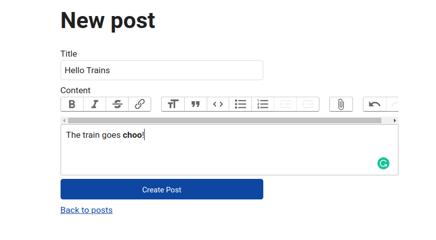

<div align = "center">

<h1><a href="https://2kabhishek.github.io/trains">trains</a></h1>

<a href="https://github.com/2KAbhishek/trains/blob/main/LICENSE">
 </a>

<a href="https://github.com/2KAbhishek/trains/graphs/contributors">
 </a>

<a href="https://github.com/2KAbhishek/trains/stargazers">
</a>

<a href="https://github.com/2KAbhishek/trains/network/members">
 </a>

<a href="https://github.com/2KAbhishek/trains/watchers">
 </a>

<a href="https://github.com/2KAbhishek/trains/pulse">
 </a>

<h3>Simple blog built with Rails 🚂🖊️</h3>

<figure>
  
  <br/>
  <figcaption>trains screenshot</figcaption>
</figure>

</div>

## What is this

trains is a demo blog built with Rails that follows best practices and is easy to enhance.

Some of the features of trains:

- Internationalization
- GraphQL API
- ActionText Support

## Inspiration

Needed a rails application to test my ideas on.

## Prerequisites

Before you begin, ensure you have met the following requirements:

- You have installed the latest version of `ruby`.

## Getting trains

To get trains, follow these steps:

```bash
git clone https://github.com/2kabhishek/trains
cd trains
bundle install
rails server
```

## Using trains

Using I18n:

Currently, trains supports only English and Spanish.

Visit `http://localhost:3000/es` to see the blog in Spanish.

Trains also supports GraphQL.

To use GraphQL, visit `http://localhost:3000/graphql` and enter the following query:

```js
    query {
      posts {
        id
        title
        content
      }
    }
```

## How it was built

trains was built using `rails`

## Challenges faced

Setting up action text with Rails 7 was a bit tricky.

## What I learned

- Explored more rails concepts
- Using I18n for model translations with the `after_find` callback

## What's next

Will try out more ideas when needed.

Hit the ⭐ button if you found this useful.

## More Info

<div align="center">

<a href="https://github.com/2KAbhishek/trains">Source</a> | <a href="https://2kabhishek.github.io/trains">Website</a>

</div>
